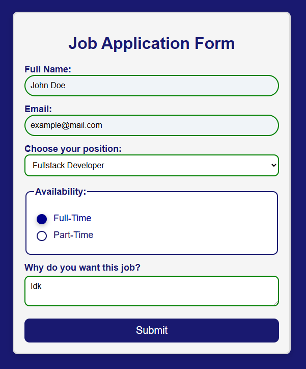
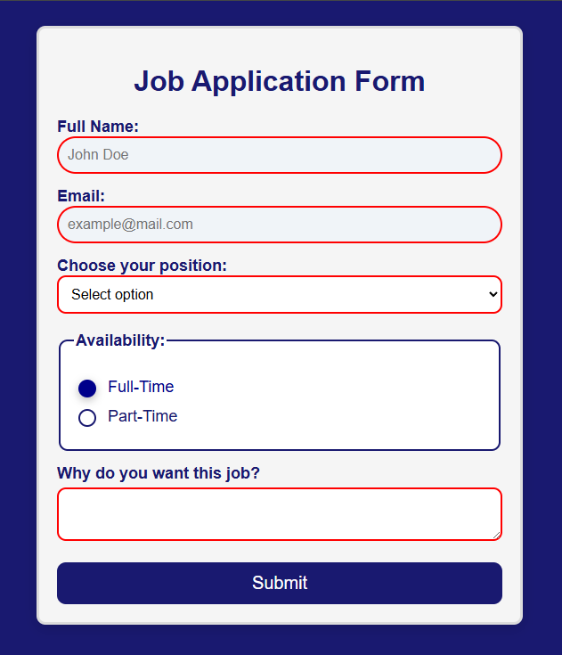

# Job Application Form 📝

A clean, responsive Job Application Form built as a lab assignment within the **FreeCodeCamp** Responsive Web Design curriculum. 

The main purpose of this project is to create a modern form interface using pure HTML5 and CSS3, focusing on pure CSS validation states and custom UI component styling without any external frameworks.

---

## 📸 Preview

Visual presentation of the form interface in empty and filled states. Clicking on any screenshot opens the interactive live deployment.

---

## 🚀 Live Demo

The interactive live page is available here:
👉 **[Open Live Demo](https://fraufer.github.io/job-application-form/)**

---

## 🛠️ Tech Stack & Concepts

* **HTML5:** Semantic structure utilizing `form`, `fieldset`, `legend`, and `textarea` tags. Explicitly linked `label` and `input` elements for better accessibility.
* **CSS3:** Pure CSS layout, custom input states, interactive hover effects, and mobile responsiveness.

---

## 🎯 Implemented Features (FreeCodeCamp Tasks)

This project strictly follows the FreeCodeCamp automated testing specifications. Key implementations include:

- [x] **Instant Form Validation:** Applied `:valid` and `:invalid` pseudo-classes to dynamically change input border colors (green for correct format, red for errors).
- [x] **Custom Radio Buttons:** Default browser radio buttons are disabled via `appearance: none;` and redesigned from scratch with custom borders, shadows, and spacing.
- [x] **Dynamic Labels:** Implemented the adjacent sibling selector (`+`) to automatically change label text colors when the corresponding radio button is selected.
- [x] **Custom Focus States:** Tailored `:focus` indicators across all fields to replace standard browser outlines with a unified theme border.
- [x] **Advanced CSS Selectors:** Used the `:first-of-type` selector to give the initial "Full Name" input field an isolated visual accent.
- [x] **Smooth Transitions:** Added transition effects to the submit button for a smoother hover interaction.

---

## ⚙️ Local Setup Instructions

Steps to run this project locally:

1. Clone the repository:
   https://github.com/fraufer/job-application-form.git

2. Navigate into the project folder:
   cd job-application-form

3. Open the project:
   Open the `index.html` file in any web browser or launch the folder inside VS Code.

---

## 📄 License

This project is open-source and licensed under the **MIT License**.
